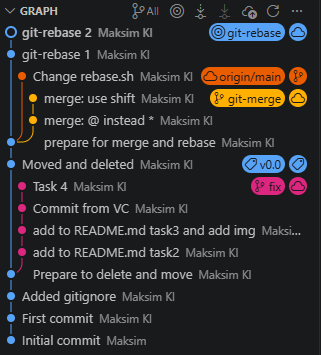
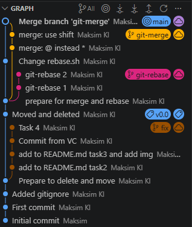
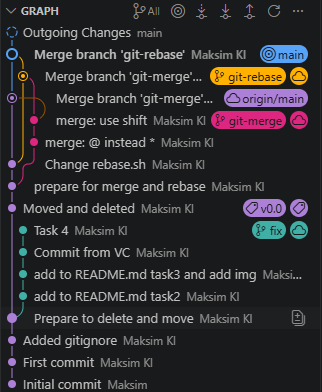

# devops-netology

First

## Второй коммит

- В результате добавления `.gitignore`, в дальнейшем будет игнорироваться папка `.terraform` и файлы с рсширением `.tfstate` `.tfstate.*` `.tfvars` `.tfvars.json`, файлы `crash.log` `crash.*.log` `override.tf` `override.tf.json` `.terraformrc` `terraform.rc`, файлы оканчивающиеся на `*_override.tf` `*_override.tf.json` в текущей и вложенных папках.

# Домашнее задание к занятию «Ветвления в Git»

## Промежуточный итог

## Итог Merge

## Итог Rebase

